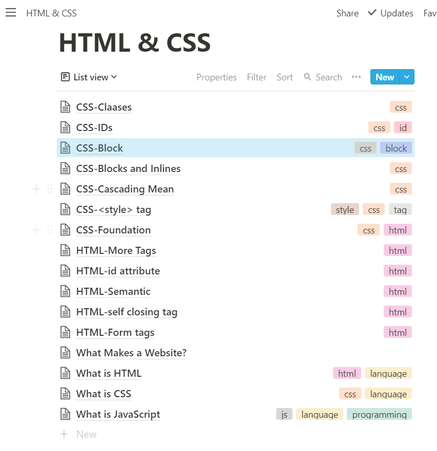
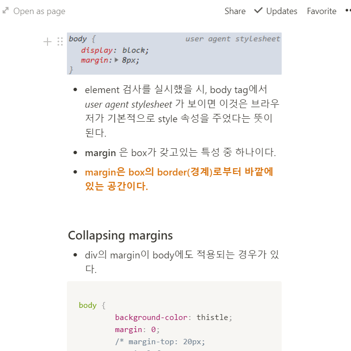

# 2주차 회고록

## Question

1. 3챕터와 무관한(??) 궁금점이긴 한데, HTML의 meta tag가 정확히 뭘 의미하는건지 잘 모르겠습니다. ㅠㅠ
2. [mdn 문서](https://developer.mozilla.org/ko/docs/Web/HTML/Element/meta)를 보면,
   뭔가 메타관련 element로 표현할 수 없는 meta data를 나타낸다는데... 요게 정확히 무슨
   뜻일까요?
3. paddings에서, top과 left를 기준으로 padding이 맞추어지는데(하나의 value만 사용했을 경우)
   이 경우에 padding이 적용된 block width,height보다 내부에 있는 block의 width, height가 크다면
   그 block을 빠져나오게 되는 것 같습니다.
   이렇게 되면 padding의 right와 bottom은 의미가 없는 것과 마찬가지가 되나요?

## Notion

- notion을 이용해서 정리해보고 있습니다!
  
  
- 노션도 같이 공유를 할 수 있는 것으로 아는데 돈이 들어서 조금 아쉽네요. ㅠㅠ

## 개선점

- 확실히 2주 클론코딩에 안들어가니까 많이 나태해지는 것 같습니다..
- 이제야 3챕터를 봤습니다. ㅠㅠ 다들 6챕터 중인 걸로 알고있는데, 자꾸 1주씩 밀려서 속상하네요ㅠㅠ
- 조금더 열심히...!!! 시간을 내 보도록 하겠습니다...!!
